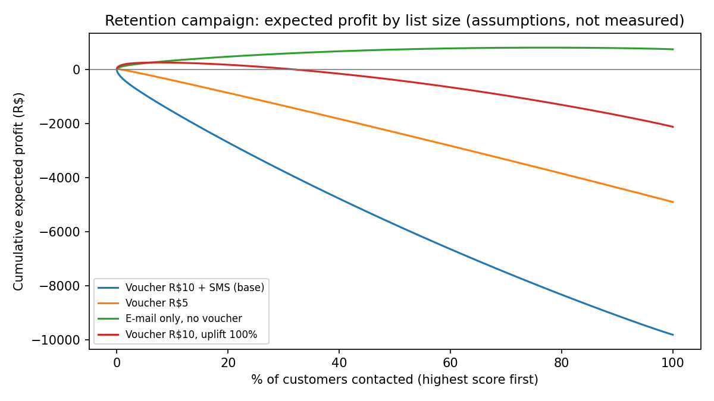

# Retention Campaign Profitability on Olist E-commerce Data

**Business question:** Which customers should an online marketplace contact with a retention offer to maximise extra profit, and is a campaign worth running at all?

**Headline finding (under stated assumptions):** a R$10-voucher campaign loses money at every list size. Customers rarely buy twice (about 1.2% in a 6-month window), so most vouchers go to people who would not have bought, or never will. Only very cheap channels (e-mail, no discount) or offers that more than double the repeat chance come close to breaking even, and even then the profit is small.

> Status: working project. Cost figures are **assumptions**, not company data. See [Limitations](#limitations).



## Approach

1. **SQL feature pipeline** (`sql/`): one row per real customer (`customer_unique_id`) built from five relational tables. Payments, reviews and items are aggregated per order first to avoid row duplication in joins.
2. **Time-based split** (`src/build_dataset.py`): no random split.

   | Set | Features use orders before | Label window | Customers | Repeat buyers |
   |---|---|---|---|---|
   | Train | 1 Sep 2017 | to 1 Mar 2018 | 21,665 | 355 (1.64%) |
   | Test | 1 Mar 2018 | to 1 Sep 2018 | 55,525 | 654 (1.18%) |

3. **Repeat-purchase models** (`src/train.py`): logistic regression and gradient boosting, judged on PR-AUC and lift (accuracy is meaningless with a 1% positive rate).
4. **Profit layer** (`src/profit.py`): calibrated probabilities converted to expected profit per customer, a cumulative profit curve, scenarios and a sensitivity grid.

## Model results (test period)

| Model | ROC-AUC | PR-AUC | Top-10% capture | Lift @ 10% |
|---|---|---|---|---|
| Logistic regression | 0.591 | 0.024 | 19.3% | 1.9x |
| Gradient boosting | 0.572 | 0.021 | 18.3% | 1.8x |

Random PR-AUC is about 0.012, so the signal is real but weak. With only 355 training positives, differences between the two models are within noise.

Calibration (`reports/calibration_by_decile.csv`): the top-scored decile is predicted at 3.2% and actually repeats at 2.4%, so the model is slightly over-optimistic at the top.

## Profit model

For each contacted customer *i* (all money in BRL):

```
profit_i = p_i * uplift * margin * AOV          # extra margin from purchases the offer causes
         - p_i * (1 + uplift) * voucher         # voucher paid on every redemption, including "sure things"
         - contact_cost
```

| Parameter | Value | Source |
|---|---|---|
| Average order value | R$164 | Measured from the data (test window) |
| Margin | 15% | **Assumption** |
| Voucher | R$10 | **Assumption** |
| Contact cost | R$0.10 | **Assumption** |
| Uplift (relative rise in repeat probability caused by the contact) | 30% | **Assumption** |

### Results

| Scenario | Customers to contact | Expected profit |
|---|---|---|
| Voucher R$10 + SMS (base) | 0 (loses money) | R$0 |
| Voucher R$5 | 66 | R$9 |
| Voucher R$10, uplift 100% | 4,137 (7.5%) | R$254 |
| E-mail only, no voucher (uplift 10%) | 42,683 (77%) | R$804 |

Full grid: `reports/sensitivity_profit.csv`. Scenarios: `reports/scenarios.csv`.

## Limitations

- **No campaign history.** Olist contains no offers or responses, so the model ranks who is *likely to return*, not who is *persuaded by an offer*. Uplift is an assumption. The correct next step is an A/B test, then uplift modelling.
- **Costs are assumptions.** Margin, voucher and contact cost are illustrative. Do not read the rupee figures as real company results.
- **Small positive class and a single cutoff pair.** Results may shift with other periods.
- **Data ends in 2018** and covers one Brazilian marketplace.
- **Responsible use.** Region (state) is used as a feature. Before real use, check performance and treatment across regions, minimise personal data, and monitor drift.

## Reproduce

1. Download the Olist dataset from Kaggle (check its licence) and put these CSVs in `data/raw/`: customers, orders, order_items, order_payments, order_reviews.
2. Run:

```bash
pip install -r requirements.txt
python src/build_dataset.py
python src/train.py
python src/profit.py
```

Raw data and the SQLite database are not committed (`data/` is git-ignored).

## Next steps

- Add product category, payment type and review-text features; train on several cutoffs for more positives.
- Replace assumed uplift with an uplift model once experiment data exists.
- Power BI dashboard and a one-page recommendation memo.

## Repository structure

```
sql/        feature and label queries (SQLite)
src/        build_dataset.py, train.py, profit.py
reports/    profit curve, calibration, scenarios, sensitivity grid
```
